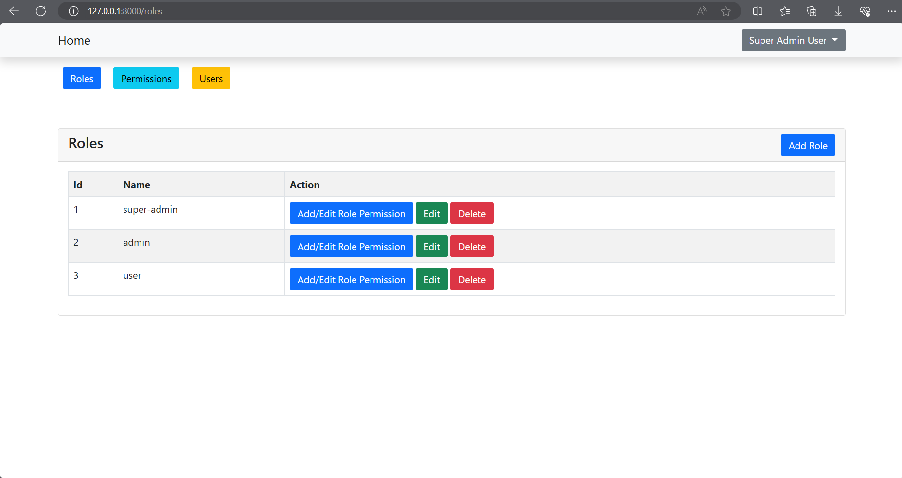
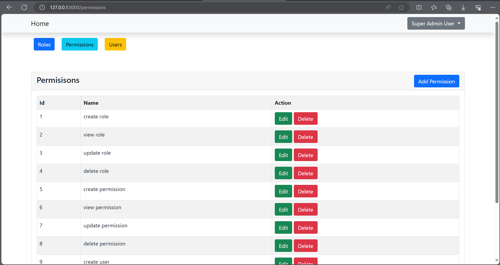
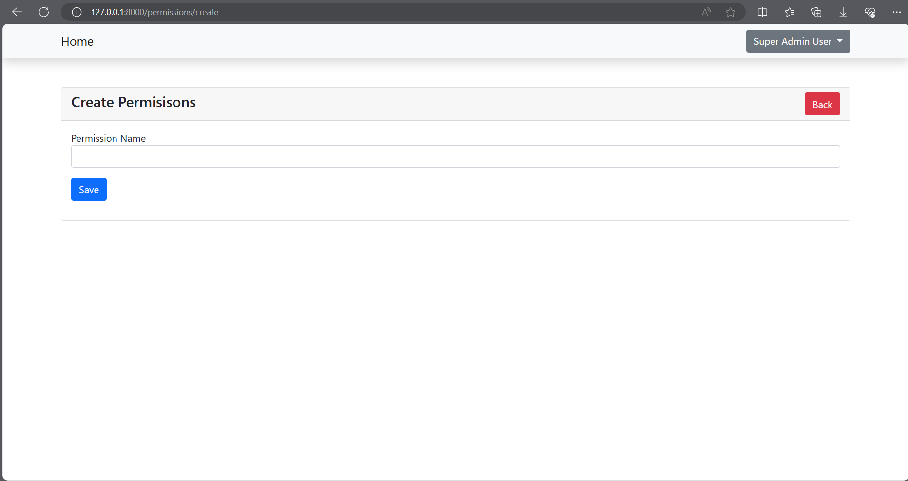
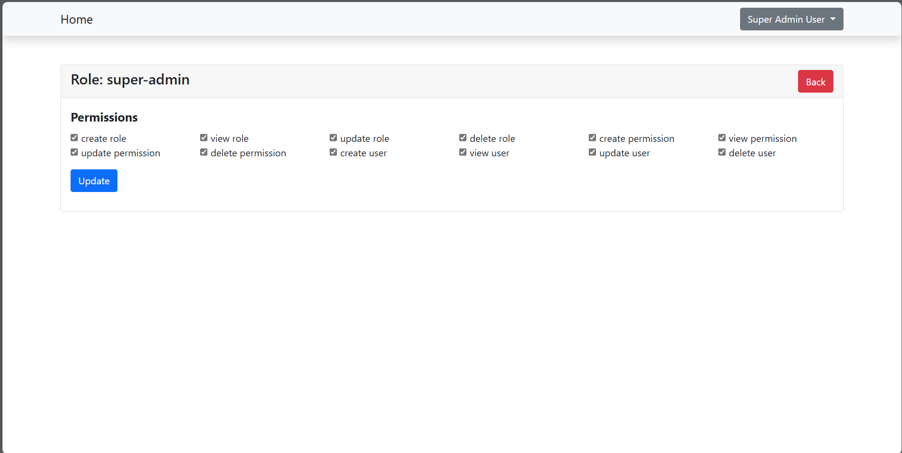
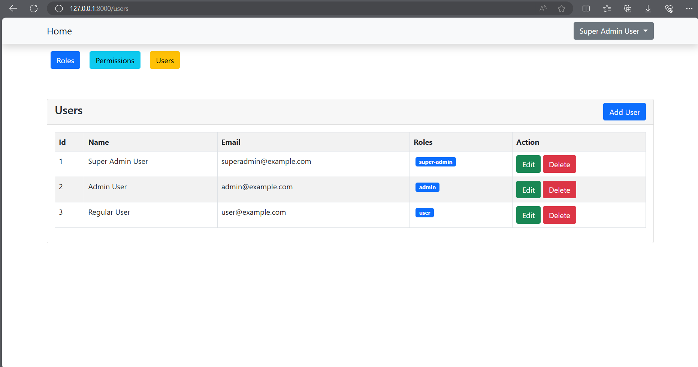

# Role and Permission Management

Follow these instructions to set he project up and run on your local machine.

## Prerequisites

What things you need to install the software and how to install them:

- [Composer](https://getcomposer.org/)
- [PHP](https://www.php.net/)
- [MySQL](https://www.mysql.com/)
- [Node.js and npm](https://nodejs.org/)

## Installation

### 1. Clone the repository:

   ```bash
   git clone https://github.com/Subal-Roy/roles-permission-management.git
   ```

### 2. Navigate to the project directory:

   ```bash
   cd roles-permission-management
   ```

### 3. Install PHP dependencies:

   ```bash
   composer install
   ```

### 4. Install npm dependencies:

   ```bash
   npm install
   ```

### 5. Copy the `.env.example` file to `.env`:

   ```bash
   cp .env.example .env
   ```

### 6. Generate application key:

   ```bash
   php artisan key:generate
   ```

### 7. Configure your `.env` file with your database credentials and other settings.

### 8. Run database migrations:

   ```bash
   php artisan migrate
   ```

### 9. Seed the database with initial data:

   ```bash
   php artisan db:seed
   ```

### 10. Serve the Application:

   ```bash
   php artisan serve
   ```
    
### 11. Run npm for vite:

   ```bash
   npm run dev
   ```

### 12. Open your web browser and navigate to `http://localhost:8000` to view the application.


## Login using the following credentials

| User | Email | Password |
|----------|----------|----------|
| Super Admin User | `superadmin@example.com` | password |
| Admin User | `admin@example.com` | password |
| Regular User | `user@example.com` | password |


## User Roles and Their Permissions

The table below lists the various user roles and their respective permissions in the system:

| User Role        | Permissions                                                                                      |
|------------------|--------------------------------------------------------------------------------------------------|
| super-admin      | All                                                                                  |
| admin            | 'view role', 'view permission', 'view user', 'create user', 'update user', 'delete user'         |
| user     | 'view user' 


# Some Screenshots of the project

## 1.Roles


## 2.Permissions


## 3.Create Role


## 4.Create Permision


## 5.Add or Update Permissions of Role


## 6.Users 

